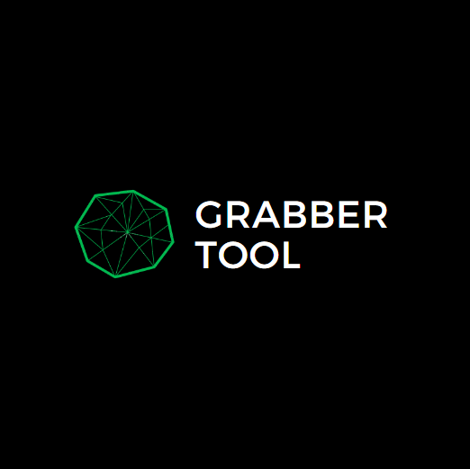

    <h1 align="center">GrabberToolAPI</h1>

    

        

            

                
            

            

                 <h2>Docs da verção em <a href="https://github.com/Isqneeh/GrabberTool">PythonScript!</h2> </a>
                 <h2><a href="https://github.com/Isqneeh/GrabberTool-WebSite">Site!</a> Oficial do GrabberTool</h2> </a>
            

        

    

    <h1>Creditos</h1>
        <table>
    <tr>
        <td align="center"><a href="https://github.com/Isqneeh"> <b>GitHub💻</b></a> <a href="https://github.com/Isqneeh/GrabberTool" title="Aquele canto de gente entelegente">Repo💻</a><a href="https://repl.it/@Isqne"> <b>Repl.it💻 </b></a></td>
    </tr>
    </table>

